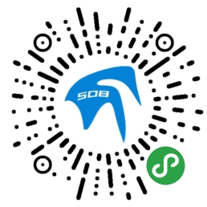

# 资源仓库
### 508 小程序版本

- #### 使用到的技术
    - ##### [taro](https://nervjs.github.io/taro/docs/README.html)
    - ##### [taro-ui](https://taro-ui.aotu.io/#/docs/introduction)

- #### 有兴趣一起开发的直接修改代码即可,每周我尽量合并发布一次代码

- #### 在运行该项目之前,请先学习taro的使用

- #### 小程序二维码
    
- #### H5地址
    - [网站](https://www.dongkji.com/h5)

